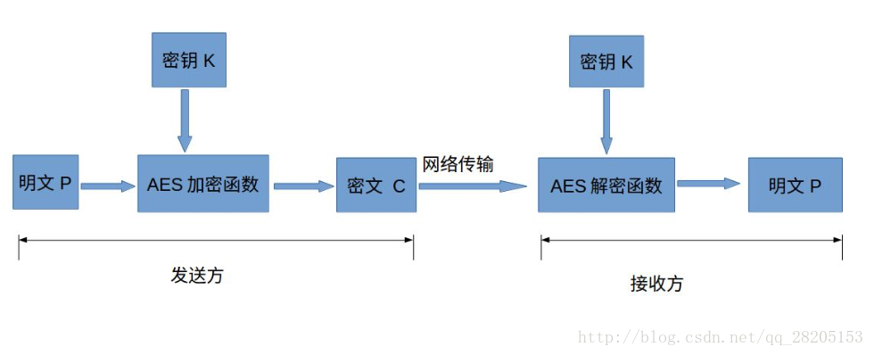
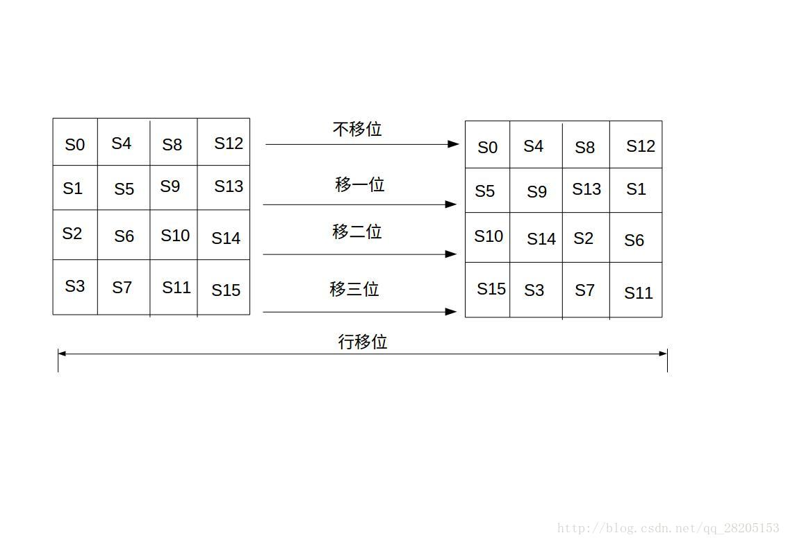
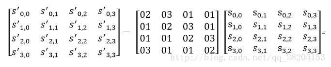
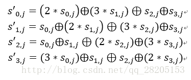
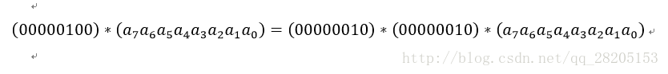
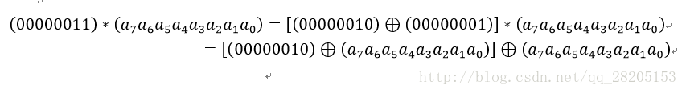
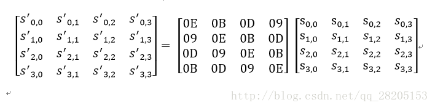

# 非对称加密演算法

## RSA
非对称加密演算法

对极大整数做因数分解的难度决定了RSA算法的可靠性，只要其钥匙的长度足够长，用RSA加密的信息实际上是不能被解破的。

### 操作
##### 公钥与私钥的产生
##### 加密消息
##### 解密消息
##### 签名消息
# 对称加密1.

加密方法可以分为两大类。一类是单钥加密（private key cryptography），还有一类叫做双钥加密（public key cryptography）。前者的加密和解密过程都用同一套密码，后者的加密和解密过程用的是两套密码。

在这里简单介绍下对称加密算法与非对称加密算法的区别。

* 对称加密算法

  加密和解密用到的密钥是相同的，这种加密方式加密速度非常快，适合经常发送数据的场合。缺点是密钥的传输比较麻烦。

* 非对称加密算法

  加密和解密用的密钥是不同的，这种加密方式是用数学上的难解问题构造的，通常加密解密的速度比较慢，适合偶尔发送数据的场合。优点是密钥传输方便。常见的非对称加密算法为RSA、ECC和EIGamal。

# AES
Advanced Encryption Standard

最常见的对称加密算法

* 明文P

  没有经过加密的数据。

* 密钥K

  用来加密明文的密码，在对称加密算法中，加密与解密的密钥是相同的。密钥为接收方与发送方协商产生，但不可以直接在网络上传输，否则会导致密钥泄漏，通常是通过非对称加密算法加密密钥，然后再通过网络传输给对方，或者直接面对面商量密钥。密钥是绝对不可以泄漏的，否则会被攻击者还原密文，窃取机密数据。

* AES加密函数

  设AES加密函数为E，则 C = E(K, P),其中P为明文，K为密钥，C为密文。也就是说，把明文P和密钥K作为加密函数的参数输入，则加密函数E会输出密文C。

* 密文C

  经加密函数处理后的数据

* AES解密函数

  设AES解密函数为D，则 P = D(K, C),其中C为密文，K为密钥，P为明文。也就是说，把密文C和密钥K作为解密函数的参数输入，则解密函数会输出明文P。

## AES基本结构
#### 加密轮数
#### 四步加密
###### 字节带换
* 正

* 逆

###### 行移位
一个简单的左循环移位操作，状态矩阵第i行移动i

* 正
左移
* 逆
右移

###### 列混合
列混合变换是通过矩阵相乘来实现的，经行移位后的状态矩阵与固定的矩阵相乘， 得到混淆后的状态矩阵，还是状态矩阵

  * 其实这种二元运算的加法等价于两个字节的异或
  * 对于一个8位的二进制数来说，使用域上的乘法乘以(00000010)等价于左移1位(低位补0)后，再根据情况同(00011011)进行异或运算

  设S1 = (a7 a6 a5 a4 a3 a2 a1 a0)

  也就是说，如果a7为1，则进行异或运算，否则不进行。

* 乘以(00000100)可以拆分成两次乘以(00000010)的运算

  
* 乘以(0000 0011)可以拆分成先分别乘以(0000 0001)和(0000 0010)，再将两个乘积异或

  

* 正

  固定矩阵

  

* 逆

  固定矩阵

  

###### 轮密钥加
轮密钥加是将128位轮密钥Ki同状态矩阵中的数据进行逐位异或操作，ki是密钥中的对应加密轮数的32比特字（包含四个字节）

轮密钥加过程可以看成是字逐位异或的结果，也可以看成字节级别或者位级别的操作。也就是说，可以看成S0 S1 S2 S3 组成的32位字与W[4i]的异或运算。

* 正||逆

轮密钥加的逆运算同正向的轮密钥加运算完全一致，这是因为异或的逆操作是其自身。轮密钥加非常简单，但却能够影响S数组中的每一位。

#### 密钥扩展
